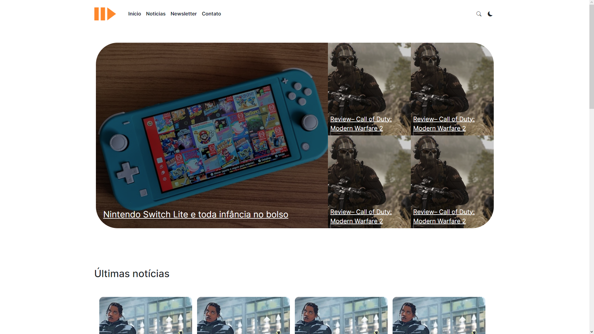

O PlayUp-News é um blog de newsletter focado no mundo dos games, que traz notícias, análises e opiniões sobre o universo dos jogos eletrônicos. O blog tem um visual moderno e intuitivo, que ajuda a engajar os leitores e mantê-los atualizados sobre as novidades do mundo dos games.
 

    <a href="https://bracoders.vercel.app" target="blank">Deploy</a>
    ·
    <a href="https://github.com/uandersoncosta/bracoders/issues">Report Bug</a>
    ·
    <a href="https://github.com/uandersoncosta/bracoders/issues">Request Feature</a>

Construi esse blog, pois desejo montar uma newsletter sobre o mundo dos games. Com isso, escolhi aprender bootstrap apenas lendo a documentação.

## 💻 Codei com

- [HMTL](https://developer.mozilla.org/en-US/docs/Web/HTML)
- [CSS](https://developer.mozilla.org/en-US/docs/Web/CSS)
- [bootstrap](https://getbootstrap.com)
- [Javascript](https://developer.mozilla.org/en-US/docs/Web/JavaScript)

## 🔗 Links uteis

Meu [LinkedIn](https://www.linkedin.com/in/uandersoncosta/) 
Meu [Portfólio](https://github.com/uandersoncosta/)

## 🙏 Apoio
Esse projeto precisa de uma ⭐️ sua. Não esqueça de deixar uma ⭐️
